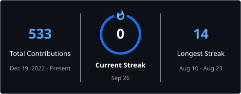

# Hi, I'm Varun 👋

### Backend & AI Developer

I build reliable backend systems and practical AI applications using Python, FastAPI, React, RAG and NLP.

---

## 👨‍💻 About Me

- 🔭 Building backend and AI-powered applications with **FastAPI, React and Python**
- 🧠 Working with **RAG, LangChain, NLP, embeddings and vector databases**
- ⚙️ Experienced in developing **REST APIs, real-time workflows and database-driven systems**
- 🌱 Currently strengthening my knowledge of **Generative AI, system design and cloud technologies**
- 🎯 Interested in **Backend AI Engineer, GenAI Engineer and Python Backend Developer** roles
- 📍 Based in Chennai, India

## 🛠️ Technical Skills

### Languages

### Backend & Frontend

### AI, ML & NLP

### Databases & Tools

## 🚀 Featured Work

### AI Evaluation & Test Execution Platform

Developing a web-based platform for executing and analysing AI test runs. The system includes configurable test plans, real-time progress updates, run controls, evaluation reports and database-backed execution history.

**Technologies:** FastAPI, React, TypeScript, SQLAlchemy, WebSockets, Docker

### Resume–Job Description Matching System

Built an AI-assisted workflow that processes resumes, retrieves relevant content and compares candidates against job descriptions using TF-IDF, cosine similarity, embeddings and RAG.

**Technologies:** FastAPI, LangChain, FAISS, Hugging Face, scikit-learn

### ARIOS — AI Research Intelligence OS

Building a modular research intelligence platform for multi-source document ingestion, NLP analysis, topic modelling, semantic search and retrieval-augmented generation.

**Technologies:** FastAPI, spaCy, NMF, Sentence Transformers, ChromaDB, RAG

## 📊 GitHub Activity

## 🤝 Let's Connect

I'm open to opportunities and collaborations in backend development, AI engineering, GenAI and NLP.

- GitHub: [github.com/rvarun03](https://github.com/rvarun03)
- LinkedIn: [Linkedin](https://www.linkedin.com/in/r-varun-012552266/)
- Email: Add your professional email here

---

### Building dependable backend systems and practical AI solutions.

